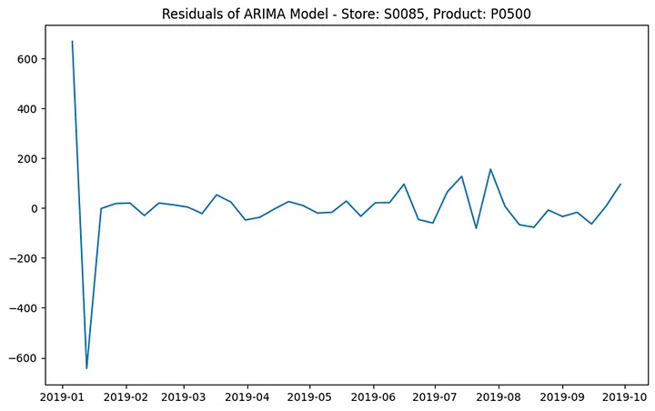

# Project II
In this paper, we describe the entire process we used to predict one week of sales. The dataset is real and was provided by a Product Owner (PO), along with some initial information about its contents. Throughout the process, we had several conversations with the PO to better understand what some of the fields represent.

The process described here includes a data analysis phase to understand the data and its relationships among all tables. Following this, we present our findings. Subsequently, we detail the ETL process used to handle the data, including populating and loading missing values, data casting, and other necessary steps. Next, we apply models such as ARIMA and Linear Models (LM) to make predictions. Finally, we explain the models and conclude with our findings.

For all phases, we opted to use Python for the various data treatments and model applications, including ARIMA and others. All code can be found in a GitHub repository located here https://github.com/yurimfreitas/ProjectII

Dataset
As mentioned before, this dataset was provided by our Product Owner, and the main goal was to predict one week of sales. We received a few CSV files:

Sales: This file contains 8,886,058 records of sales, including information about price, product, store, and other details about promotions and discounts.
Product: This file contains information about the products, with a total of 699 records.
Cities: This file contains information about the stores and their locations, with a total of 63 entries.
Forecast Revenue: This file contains 1,943 records, representing the forecasted revenue for one month.
1. Data Understanding
Data understanding will help us to know all about our data:

· Understanding our data

· Exploring structure of data

· Recognizing relationship between variables

Briefly, Data Profiling tell us almost everything about data.

Here are some point we want to investigate in our data

1.1. Understanding our data
In the sales information, we can check the following fields:

Figure 1 — Sales information

By looking at these data, it is clear that we will need to treat many columns in the next phase.

For the other data, such as product, cities, and forecast revenue, refer to Appendix 1.

1.2. Missing values and conversions
Considering sales information: After checking the data types of the columns above, we identified the need to convert some of them. Initially, we will need to cast the field ‘date’ to the DATE type.

Another necessary task will be to replace NaN values with something meaningful. For columns of type string, replace NaN values with a meaningful string. For columns of type float, replace NaN values with a meaningful float. Additionally, for all titles without a name, replace them with a relevant field meaning. We could use the following logic to replace NaN values:

For string columns: Replace NaN with a specific string, such as “Unknown” or “No Data.”
For numeric columns: Replace NaN with a specific value, such as 0 or the mean/median of the column.
For title fields: Replace NaN or missing values with the corresponding field name or another relevant default value.
Here’s how we will apply this logic to each field in the subsequent phase:

1.3. Relationship between variables
The relationships between the tables are primarily established through key fields. These are: store_id in the cities data frame, product_id in the product data frame, and store in the forecast revenue data frame.

2. Data Profiling
Key aspects of data profiling that we will include and address if necessary are:

Analyzing Data Quality: Assessing the accuracy, completeness, and consistency of the data.
Discovering Metadata: Extracting metadata, such as data types.
Identifying Anomalies: Detecting outliers, missing values, duplicate records, and other anomalies.
Understanding Data Structure: Examining the schema and formats.
Prior to executing any data profiling or transformation, we need to remove the last 30 days of data from the sales dataset, because we will need to predict that. Refer to Appendix 2.

We excluded products with no sales in September 2019 because our goal is to forecast sales for weeks 40, 41, and 42 of that year. For the ARIMA model to generate accurate predictions, it is essential to have sales data from September. This ensures that the model can make more precise forecasts. Refer to Appendix 3.

Another aspect of our data profiling involved applying transformations based on our understanding of the data, including converting data types and filling in missing values. We implemented these transformations using a Python pipeline that incorporated all the necessary steps. Refer to Appendix 4.

3. Data Transforming
Data transformation is where we merged the data to better understand its distribution and ensure consistency across datasets. This process included normalizing values, creating new features, and aggregating data to capture trends and patterns. By transforming the data, we aimed to enhance its quality and usability for subsequent analysis.

We merged the sales data with product and store data using their appropriate keys, product_id and store_id, respectively.

One point the product owner informed us of is that we can predict for a minimum of one city with three stores. Therefore, we want to identify the cities and stores with the highest sales to select the stores for our predictions. We will analyze sales performance metrics such as total sales volume and total revenue. Refer to Appendix 5.

The graphs demonstrate that the city with the highest sales is Istanbul, and the top 5 stores are ‘S0020’, ‘S0026’, ‘S0062’, ‘S0085’, and ‘S0097’. We can filter by these stores at this point.

df_sales_filtered = df_sales_comp[df_sales_comp['city_code'] == 'Istanbul']
# List of store IDs to filter
store_ids = ['S0020', 'S0026', 'S0062', 'S0085', 'S0097']

# Filter the DataFrame based on the store_id column
df_sales_filtered = df_sales_comp[df_sales_comp['store_id'].isin(store_ids)]
3.1 Number of products to be managed
After performing the necessary filters and transformations, we now want to check the number of products we need to predict. This will give us an idea of how many iterations we will have when applying the ARIMA model. Understanding the product count is crucial for estimating computational requirements and ensuring efficient processing. Additionally, it helps in planning the validation and evaluation phases of our predictive modeling.

For that refer to appendix 6.

3.2 Select only the columns we are going to use and slice data
To streamline the process, we will remove columns that are not needed for applying the model. This will simplify the process and reduce computational resource usage. Additionally, we will slice the data into different DataFrames as follows:

df_sales_filtered_all: Contains all data from 2017 to 2019.
df_sales_filtered_2018_2019: Contains data from 2018 to 2019.
df_sales_filtered_last_6_months: Contains data from the last six months.
With these datasets, we can compare which one will bring better results after applying the model. For instance, using the entire dataset might introduce distortions in predicting some products due to seasonality. By evaluating different slices of data, we can identify the dataset that provides the most accurate predictions.

from datetime import datetime, timedelta

# Select only the specified columns
df_sales_filtered_all = df_sales_filtered[['store_id', 'product_id', 'date', 'sales', 'revenue', 'stock', 'price']]
df_sales_filtered_2018_2019 = df_sales_filtered[df_sales_filtered['date'].dt.year > 2017]
df_sales_filtered_2019 = df_sales_filtered[df_sales_filtered['date'].dt.year > 2018]

# Filter data for the last 6 months
df_sales_filtered_last_6_month = df_sales_filtered[df_sales_filtered['date'] > datetime(2019, 9, 29) - timedelta(days=6*30)]
3.3 Grouping data weekly by product and store
Another step was create a function to processes sales data by grouping it on a weekly basis for each product and store. It does this by first adding columns for the week number and year derived from the date column, and then dropping the date column as it is no longer needed.

The function defines a custom aggregation method to retrieve the last value in a series, which is used to get the most recent stock and price for each group. The sales and revenue data within each group are summed up. This grouped data, now summarized by week, store, and product, provides a clearer picture of weekly sales performance. Finally, the function is applied to different filtered datasets to prepare them for further analysis, such as predicting future sales trends. Refer to appendix 7.

3.4 Save the data
As the final part of data transformation, we load the data. In summary, the code is serializing the four processed DataFrames into separate .pkl files using joblib, which facilitates quick loading of the data in future sessions without the need to reprocess the raw data again. Here, we have most of the data engineering work done. Refer to appendix 8.

Here is a sample of how the data looks like now:

4. Exploratory Data Analysis
As the initial step in our Exploratory Data Analysis (EDA), we added a new column representing the last day of each week. This will be useful for applying the ARIMA or ARIMAX model. Additionally, we transformed that date into a time series to be used in the model, as the ARIMA method expects a time series format:

4.1 Preparing to Apply the ARIMA and ARIMAX Models
The following code, refer to appendix 9, performs preparation for ARIMAX and ARIMA modeling by grouping sales data, optimizing ARIMAX parameters through a grid search, and handling errors. It forecasts sales for the next three weeks for each store-product combination and stores the results and any encountered errors in separate DataFrames.

The provided image shows the content of the DataFrame df_forecasts, which contains the forecasts for different store-product combinations along with the ARIMAX parameters used. Here’s a brief overview of what this DataFrame displays:

4.2 Unpivoting the Forecast
The next step does several steps to unpivot and (melt) the forecast data, adjust week numbers for forecasts, and merge this data with actual sales data. Here’s a brief explanation of what the code is doing. Refer to appendix 10:

· Unpivot the Forecasts DataFrame

· Extract Week Number

· Reset Index

· Find Latest Year and Week

· Merge Forecasts with Latest Week Information

· Adjust Forecast Week Numbers

· Calculate Last Day of the Forecast Week

· Select and Rename Columns

· Concatenate Sales and Forecast Data

· Final DataFrame

After performing the algorithm to unpivot the forecast, this is how the data looks:

Notice that the last three records are the predictions for store S0097 and product P0704, corresponding to weeks 40, 41, and 42.

4.3 Error Dataframe
For every store and product that the models were not capable of predicting, we stored the information in an error dataframe:

5. Model Evaluation
Based on the statistics provided for the data frames df_metric_2019, df_metrics_last_6_month, df_metrics_all, and df_metrics_2018_2019, we can analyze the performance of the fitted ARIMA models and discuss why the df_metric_2019 data frame can be considered the best for obtaining forecast results using the ARIMA model.

5.1 Comparative Analysis
Average Values The averages of the metrics MSE (Mean Squared Error), RMSE (Root Mean Squared Error), MAE (Mean Absolute Error), and MAPE (Mean Absolute Percentage Error) are generally lower for df_metric_2019 compared to the other datasets, indicating that the model errors are smaller when trained with 2019 data. Lower error values suggest better ARIMA model performance.
Standard Deviation The standard deviation of the metrics for df_metric_2019 also tends to be lower, especially for MSE, RMSE, and MAE. This suggests that the errors are more consistent and less dispersed, which is desirable for model stability.
Median The medians of the metrics for df_metrics_2019 are generally in line with the medians of the other datasets, indicating that the error distribution is comparable. However, the combination of a lower mean and lower standard deviation makes the 2019 dataset the most consistent.
5.2 Final Considerations
Consistency and Reliability: The lower mean and standard deviation of the metrics for the df_metrics_2019 dataset indicate that models trained with 2019 data are more consistent and have less variation in their errors. This is important for the reliability of the forecast.
Lower Errors: Lower average values of MSE, RMSE, MAE, and MAPE suggest that the model trained with the 2019 dataset has a better fit to the historical data and is therefore more likely to produce more accurate predictions.
Based on these observations, we can conclude that the df_metrics_2019 dataset is the best for training ARIMA models to obtain more accurate and reliable forecasts.

Metric Comparison Table:

For reference you can check some residual plots in appendix 11.

6. Final Results
Two CSV files were provided, containing all stores and products selected for evaluation — one containing the ARIMA model and the other containing the ARIMAX model. The business can then create a dashboard using Power BI to check the predictions.

6.1 Power BI dashboard
Using the csv file saved we were able to create the following dashboard:

Appendix
Data we received from the PO (cities, product and forecast revenue), here are examples:

2. Last month extracted from the main sales data frame:

3. Removed products with no sales in September of 2019:

4. Pipeline to apply findings detected in data understanding:

5. Total sales by top 5 cities and and top 5 stores

6. Total of products to be managed

7. Code responsible for grouping by store, product and week:

def process_sales_data(df):
     
    # Create new columns for the week of the year and year
    df['week'] = df['date'].dt.isocalendar().week
    df['year'] = df['date'].dt.isocalendar().year
    
    # Drop the date column as it's not needed for grouping
    df = df.drop(columns=['date'])
    
    # Define a custom aggregation function to get the last value
    def last_value(series):
        return series.iloc[-1]
    
    # Group by store_id, product_id, year, and week, then apply aggregations
    df = df.groupby(['store_id', 'product_id', 'year', 'week']).agg({
        'sales': 'sum',
        'revenue': 'sum',
        'stock': last_value,
        'price': last_value  # Use the custom aggregation function for 'price'
    }).reset_index()
    
    return df

df_sales_filtered_all = process_sales_data(df_sales_filtered_all)
df_sales_filtered_2018_2019 = process_sales_data(df_sales_filtered_2018_2019)
df_sales_filtered_2019 = process_sales_data(df_sales_filtered_2019)
df_sales_filtered_last_6_month = process_sales_data(df_sales_filtered_last_6_month)

8. Load data into csv and pkl:

# Save the DataFrame to a CSV file
df_sales_filtered.to_csv('./Files/df_sales_filtered_all.csv', index=False)

import joblib
joblib.dump(df_sales_filtered_all, 'df_sales_filtered_all.pkl')
joblib.dump(df_sales_filtered_2018_2019, 'df_sales_filtered_2018_2019.pkl')
joblib.dump(df_sales_filtered_2019, 'df_sales_filtered_2019.pkl')
joblib.dump(df_sales_filtered_last_6_month, 'df_sales_filtered_last_6_month.pkl')
9. Preparing and applying ARIMAX:

# Group by 'store_id' and 'product_id'
grouped = df_sales_filtered_last_6_month.groupby(['store_id', 'product_id'])

# Create a DataFrame to store forecasts and a data frame to have those product/store with error
df_forecasts = pd.DataFrame(columns=['store_id', 'product_id', 'forecast_week_1', 'forecast_week_2', 'forecast_week_3', 'ARIMAX'])
df_product_error = pd.DataFrame(columns=['store_id', 'product_id', 'error_message'])

from statsmodels.tsa.arima.model import ARIMA
import warnings
from itertools import product
from sklearn.metrics import mean_squared_error, mean_absolute_error, mean_absolute_percentage_error
import pandas as pd
import joblib

# Function to perform grid search for ARIMA parameters
def optimize_arima(series, p_values, d_value, q_values):
    best_aic = float("inf")
    best_order = None
    best_model = None
    for p, q in product(p_values, q_values):
        try:
            model = ARIMA(series, order=(p, d_value, q))
            model_fit = model.fit()
            aic = model_fit.aic
            if aic < best_aic:
                best_aic = aic
                best_order = (p, d_value, q)
                best_model = model_fit
        except:
            continue
    return best_order, best_model

# Function to calculate MSE, RMSE, MAE, MAPE
def calculate_metrics(actual, predicted):
    mse = mean_squared_error(actual, predicted)
    rmse = mean_squared_error(actual, predicted, squared=False)
    mae = mean_absolute_error(actual, predicted)
    mape = mean_absolute_percentage_error(actual, predicted)
    return mse, rmse, mae, mape

# Grid search parameters
p_values = range(0, 3)
d_value = 1
q_values = range(0, 3)

# DataFrames to store results
df_forecasts = pd.DataFrame(columns=['store_id', 'product_id', 'forecast_week_1', 'forecast_week_2', 'forecast_week_3', 'ARIMA'])
df_product_error = pd.DataFrame(columns=['store_id', 'product_id', 'error_message'])
df_mse = pd.DataFrame(columns=['store_id', 'product_id', 'mse', 'rmse', 'mae', 'mape'])

# Iterate over each group
for (store_id, product_id), group in grouped:
    # Reindex to ensure complete weekly intervals
    group = group.asfreq('W-SUN', method='pad')
    
    # Ensure there are enough data points to fit the model
    if len(group) < 2:
        df_product_error = pd.concat([df_product_error, pd.DataFrame([{
            'store_id': store_id,
            'product_id': product_id,
            'error_message': 'Not enough data points to fit ARIMA model'
        }])], ignore_index=True)
        continue
    
    warnings.filterwarnings("ignore")  # specify to ignore warning messages

    # Fit ARIMA model
    try:
        best_order, best_model = optimize_arima(group['sales'], p_values, d_value, q_values)
       
        if best_model is not None:
            # Forecast future sales (next 3 weeks)
            forecast = best_model.forecast(steps=3)
            
            # Append the forecast to the DataFrame
            df_forecasts = pd.concat([df_forecasts, pd.DataFrame([{
                'store_id': store_id,
                'product_id': product_id,
                'forecast_week_1': forecast[0],
                'forecast_week_2': forecast[1],
                'forecast_week_3': forecast[2],
                'ARIMA': best_order
            }])], ignore_index=True)
            
            # Calculate metrics (assuming you have actual future sales for comparison)
            # Replace 'actual_future_sales' with your actual sales data for the next 3 weeks
            actual_future_sales = group['sales'][-3:]  # Adjust based on actual data availability
            if len(actual_future_sales) == 3:
                mse, rmse, mae, mape = calculate_metrics(actual_future_sales, forecast)
                # Append the metrics to the DataFrame
                df_mse = pd.concat([df_mse, pd.DataFrame([{
                    'store_id': store_id,
                    'product_id': product_id,
                    'mse': mse,
                    'rmse': rmse,
                    'mae': mae,
                    'mape': mape
                }])], ignore_index=True)
            else:
                df_product_error = pd.concat([df_product_error, pd.DataFrame([{
                    'store_id': store_id,
                    'product_id': product_id,
                    'error_message': 'Not enough actual future data to calculate metrics'
                }])], ignore_index=True)
        else:
            df_product_error = pd.concat([df_product_error, pd.DataFrame([{
                'store_id': store_id,
                'product_id': product_id,
                'error_message': 'Failed to find suitable ARIMA model'
            }])], ignore_index=True)
    except Exception as e:
        print(f"Error fitting ARIMA for Store: {store_id}, Product: {product_id}")
        print(str(e))
        df_product_error = pd.concat([df_product_error, pd.DataFrame([{
            'store_id': store_id,
            'product_id': product_id,
            'error_message': str(e)
        }])], ignore_index=True)
10. Unpivot the forecast and melt:

import numpy as np
import pandas as pd

# Assuming df_forecasts and df_sales_filtered_last_6_month are already defined

# Pivot the forecasts DataFrame
df_forecasts_melted = df_forecasts.melt(id_vars=['store_id', 'product_id', 'ARIMAX'], 
                                        value_vars=['forecast_week_1', 'forecast_week_2', 'forecast_week_3'], 
                                        var_name='week', value_name='forecast')

# Extract the week number from the 'week' column
df_forecasts_melted['week'] = df_forecasts_melted['week'].str.extract('(\d+)').astype(int)

# Resetting index to ensure last_day_of_week is a regular column
df_sales_filtered_last_6_month.reset_index(drop=False, inplace=True)

# Step 1: Find the latest year and week number for each store_id and product_id
latest_weeks = df_sales_filtered_last_6_month.groupby(['store_id', 'product_id'])[['year', 'week']].max().reset_index()
latest_weeks.columns = ['store_id', 'product_id', 'latest_year', 'latest_week']

# Step 2: Merge the latest year and week numbers with the forecast DataFrame
df_combined = df_forecasts_melted.merge(latest_weeks, on=['store_id', 'product_id'], how='left')

# Step 3: Add the forecast weeks to the latest week numbers, adjusting for year transition
def adjust_year_week(row):
    new_week = row['latest_week'] + row['week']
    new_year = row['latest_year']
    while new_week > 52:  # Assuming 52 weeks in a year
        new_week -= 52
        new_year += 1
    return new_year, new_week

df_combined[['forecast_year', 'forecast_week']] = df_combined.apply(
    lambda row: adjust_year_week(row), axis=1, result_type="expand"
)

# Step 4: Calculate the forecast's last_day_of_week based on forecast_year and forecast_week
def get_last_day_of_iso_week(year, week):
    first_day_of_year = pd.Timestamp(year, 1, 4)
    first_monday_of_year = first_day_of_year - pd.Timedelta(days=first_day_of_year.weekday())
    week_start_date = first_monday_of_year + pd.Timedelta(weeks=week-1)
    return week_start_date + pd.Timedelta(days=6)

df_combined['last_day_of_week'] = df_combined.apply(
    lambda row: get_last_day_of_iso_week(row['forecast_year'], row['forecast_week']), axis=1
)

# Step 5: Select and rename the necessary columns to match the desired format, using forecast as sales
df_combined_final = df_combined[['store_id', 'product_id', 'forecast_year', 'forecast_week', 'forecast', 'last_day_of_week', 'ARIMAX']]
df_combined_final.columns = ['store_id', 'product_id', 'year', 'week', 'sales', 'last_day_of_week', 'ARIMAX']

# Include 'stock' column in the final combined data with 0 for forecasted sales
df_combined_final['stock'] = 0

# Step 6: Concatenate with the original sales DataFrame
df_sales_final = df_sales_filtered_last_6_month[['store_id', 'product_id', 'year', 'week', 'sales', 'stock', 'last_day_of_week']]
df_sales_final['ARIMAX'] = np.nan  # Adding ARIMAX column with NaN for actual sales

df_final = pd.concat([df_sales_final, df_combined_final[['store_id', 'product_id', 'year', 'week', 'sales', 'stock', 'last_day_of_week', 'ARIMAX']]], ignore_index=True).sort_values(by=['store_id', 'product_id', 'year', 'week'])

# Display the final DataFrame
df_final
11. Residual Charts:

